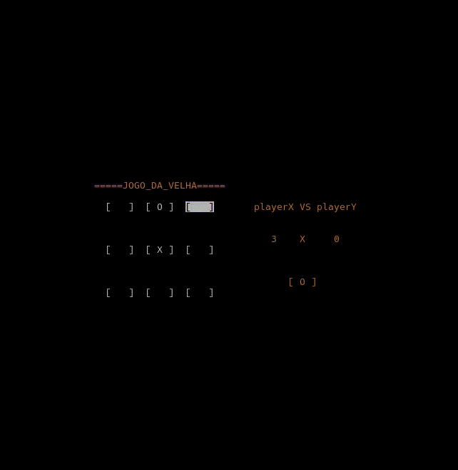

# PROJETOS DA FACULADE
## FAZENDO COISAS COM A BIBLIOTECA NCURSES

*Para funcionar precisa do compilador **clang** , a ferrameta **make** e a Biblioteca **ncurses**, funciona exclusivamente no Linux e a ferramenta git.*

### Instalar Dependecias;

**Arch:**
````bash
sudo pacman -S ncurses clang make git
````
**Ubuntu:**
````bash
sudo apt install ncurses clang make git
````
**Copie repositorio com comando:**

````bash
https://github.com/leuender01/estruturas_de_dad0s_em-C.git
````

## TETRIS

 

*Nao a um **limite de pontos***

### Executar
````bash
make tetris
````
## JOGO DA VELHA 



*Quando qualquer **jogador passar de 5 VENCE***

### Executar
````bash
make jogo-da-velha
````

