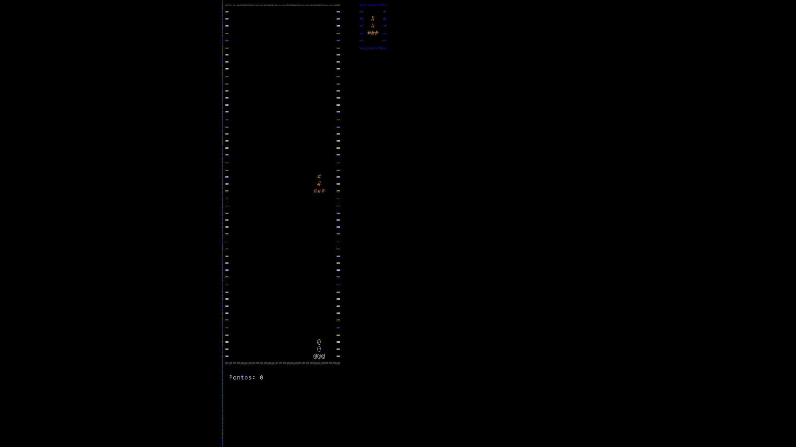

# PROJETOS DA FACULADE
## TETRIS USANDO A BIBLIOTECA NCURSES

  

*Precisa do **clang** , a ferrameta **make** e a Biblioteca **ncurses**, funciona exclusivamente no Linux.*

### Instalar Dependecias;

**Arch:**
````bash
sudo pacman -S ncurses clang make
````
**Ubuntu:**
````bash
sudo apt install ncurses clang make
````

### Executar Caso ja tiver instalado;
````bash
make tetris
````
 